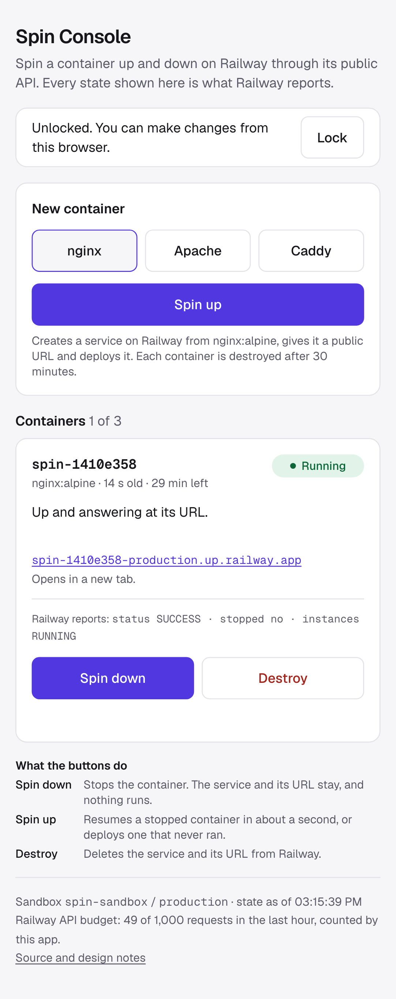

# Spin Console

A small web app that spins a container up and down on [Railway](https://railway.com) through its public GraphQL API. It is my answer to the take-home in Railway's hiring process for the Senior Full-Stack Engineer (Product) role. The app keeps no data of its own: every state on the screen is what Railway reports, read fresh.

**Live:** https://spin-console-production.up.railway.app (reading is open; changing anything needs a passphrase, which I will share for the review)



Khalid Ahammed · [khalidahammed.com](https://khalidahammed.com) · [github.com/khalid999devs](https://github.com/khalid999devs)

## What it does

- **Spin up** creates a service in a sandbox project from one of three images, gives it a public URL and deploys it.
- **Spin down** stops the container. The service and URL stay.
- **Spin up** again resumes the same container in about a second.
- **Destroy** deletes the service.

Each card shows the state in words, Railway's raw values underneath, the container's URL, its age and the time left before it is destroyed automatically.

## Run it

Needs Node 24.

**Without a Railway account** (an in-memory fake that behaves as the probe saw the real API behave):

```bash
npm install
npm run dev:fake        # http://localhost:3000, passphrase: demo
```

**Against Railway:** create an empty project to act as the sandbox, create a project token for its `production` environment (Project → Settings → Tokens), and put three variables in `.env.local`:

```bash
RAILWAY_SANDBOX_TOKEN=   # the project token
CONSOLE_PASSPHRASE=      # anything; unlocks the buttons
SESSION_SECRET=          # openssl rand -hex 32
```

```bash
npm run dev
```

The app finds the project and environment from the token, so there are no ids to configure.

## Checks

```bash
npm run verify   # lint, typecheck, unit tests, production build, client bundle check
npm run e2e      # one Playwright pass at phone width against the fake (npx playwright install chromium first)
npm run smoke -- <url>   # the live smoke test below; needs CONSOLE_PASSPHRASE and creates real containers
```

The first two need no token and no network. The tests cover the state derivation (as a table, and by replaying the recorded probe run), error classification (against the errors the real API returned), idempotent create, lost responses, the cap under concurrency, the lifetime sweep, the passphrase gate, and the guarantee that a service the app did not create is never touched.

`check:bundle` fails the build if the Railway API host, the name of a secret variable or a secret's value appears in the files the browser downloads.

I also broke six things on purpose to see the tests fail, then restored them:

| Deliberate break | Tests that failed |
|---|---|
| `deriveState` reads `deploymentStopped` before `status` | 29 |
| A mutation is repeated without looking at Railway first | 4 |
| Every service in the sandbox counts as the app's own | 5 |
| The session signature is not checked | 3 |
| The transport retries mutations like queries | 1 |
| Writes skip the serial queue | 2 |
| The API host is imported into a client component | `check:bundle` failed |

## Design in brief

The full reasoning, with the alternative rejected for each decision, is in **[docs/erd.md](docs/erd.md)**.

- **Railway is the only source of truth.** No database. A refresh, an app restart or a deletion in Railway's dashboard cannot make the app disagree with reality.
- **One pure function, [`deriveState`](src/server/console/derive-state.ts),** turns Railway's report into a state and the allowed actions. The server sends both, so a button is disabled for the reason the API would refuse it.
- **Idempotent create without a database.** The browser's operation id becomes the service name, and Railway refuses a duplicate name.
- **Two projects.** The app holds a project token for the sandbox only, so a bug in "destroy" cannot reach the app.
- **Polling paced by a token bucket** sized from Railway's `RateLimit-Policy` header. Ten open tabs cost the same as one, and no open tab costs nothing.
- **One module, [`src/server/railway`](src/server/railway),** is the only code that knows Railway exists, behind an interface with a fake.

Before building I probed the API. What it did, including six places where it differs from the docs, is in **[docs/api-findings.md](docs/api-findings.md)**. The finding that changed the most: `deploymentStop` returns `true` for `traefik/whoami`, the container goes down, and Railway keeps reporting it as running. So the UI treats "accepted" and "reported" as different things, and an image is allowed only after `npm run probe -- imageStop <image>` shows its stop is reported.

## Cost guards

The URL is public and the credit is mine.

1. Reads are open; writes need the passphrase (a cost barrier, not authentication).
2. At most 3 containers, stopped ones included.
3. A fixed list of images, each one probed. No free-text image field.
4. Every container is destroyed after 30 minutes.
5. Serverless sleep on every container.
6. Only services named `spin-` plus 8 characters are ever listed or touched.

## Live smoke test

Run on 6 Oct 2026 at 09:14 UTC with `npm run smoke -- https://spin-console-production.up.railway.app`: the deployed app, real Railway, and a new browser context for each pass (no cookies, no cache). "Seconds" is what a visitor waits, so it includes the app's 2-second polling.

**Desktop, 1280 px**

| Step | Seconds | Result |
|---|---|---|
| Open the page | 1.7 | locked, 0 containers |
| Unlock with the passphrase | 0.9 | unlocked |
| Spin up (double click) until the card appears | 1.8 | 1 container, spin-e8a453e1 |
| Refresh the page mid-deploy | 0.6 | 1 container still listed |
| Wait until Railway reports running | 13.9 | status SUCCESS · stopped no · instances RUNNING |
| Request the container's own URL | 0.6 | HTTP 200 |
| Spin down until Railway reports stopped | 2.8 | status SUCCESS · stopped yes · instances EXITED |
| Request the URL while stopped | 8.0 | no answer within 8 s |
| Spin up again until Railway reports running | 3.8 | status SUCCESS · stopped no · instances RUNNING |
| Request the URL again | 0.4 | HTTP 200 |
| Destroy (two taps) until the card is gone | 4.9 | 0 containers |

**Phone, 412 px (Pixel 7)**

| Step | Seconds | Result |
|---|---|---|
| Open the page | 1.8 | locked, 0 containers |
| Unlock with the passphrase | 0.9 | unlocked |
| Spin up (double click) until the card appears | 2.3 | 1 container, spin-1410e358 |
| Refresh the page mid-deploy | 0.6 | 1 container still listed |
| Wait until Railway reports running | 11.9 | status SUCCESS · stopped no · instances RUNNING |
| Request the container's own URL | 0.6 | HTTP 200 |
| Spin down until Railway reports stopped | 5.4 | status SUCCESS · stopped yes · instances EXITED |
| Request the URL while stopped | 8.0 | no answer within 8 s |
| Spin up again until Railway reports running | 5.9 | status SUCCESS · stopped no · instances RUNNING |
| Request the URL again | 0.4 | HTTP 200 |
| Destroy (two taps) until the card is gone | 4.4 | 0 containers |

Afterwards the sandbox held 0 containers, and the app had made 66 of its 1,000 hourly Railway requests.

Two things from a run a few minutes earlier, read from the app's HTTP log:

- **The double click really did send two requests.** Two `POST /api/containers` arrived in the same second with one operation id, and one container was created.
- **One destroy took 17.9 s.** Railway had not answered `serviceDelete` within the app's 15-second timeout. The app looked at Railway, saw the container was gone and reported success. The write timeout is now 30 seconds so a slow delete is not sent twice.

## Known limits

- **One app instance.** The write queue, read cache, request budget and attempt throttle are in memory. Two instances could not create duplicates but could race past the cap.
- **As right as Railway's report.** The app repeats what the API says, and the `traefik/whoami` case shows the API can be wrong about a container.
- **No history** of who did what.
- **The lifetime needs the app running.** While it is down, containers outlive 30 minutes; serverless sleep bounds the cost.
- **`crashed` and `failed` have not been seen against the real API.** No probe deploy failed, so those two states come from the schema's enum.
- **In fake mode a sleeping container stays asleep,** because its URL is not real and cannot be opened to wake it.

## How this was built

I built this with Claude Code. It wrote the code, the probe and the first drafts of these documents, working from a brief I prepared with Claude from Railway's docs.

What I decided: to keep it small and stateless instead of adding a database and a background observer; the two-project split; the cost guards; a phone-first screen; and, when I reviewed the ERD before the build, to accept the changes the probe forced, such as dropping `traefik/whoami`.

The brief I started from included API behaviour reported in the write-ups of two public solutions to this take-home, [paveliko/railway-container-console](https://github.com/paveliko/railway-container-console) and [V473r10/railway-take-home](https://github.com/V473r10/railway-take-home). I did not read their source code. Every finding marked "Observed" in `docs/api-findings.md` comes from my own probe, and its raw logs are in `tests/fixtures/probe`.

What this version does differently: both of those are larger, with a database and a background observer. This one stores nothing and polls only while someone is looking, and the ERD argues why that is enough for this problem and where it stops being enough.

Interview notes for myself are in [docs/walkthrough.md](docs/walkthrough.md).
