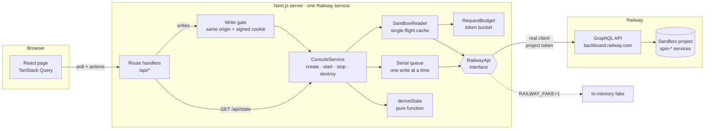
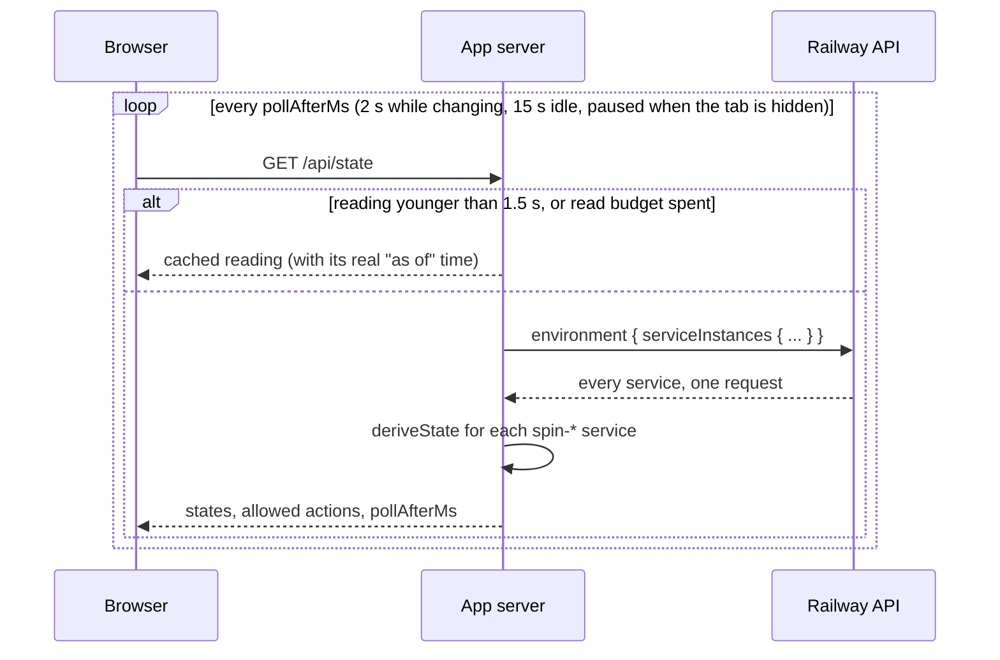
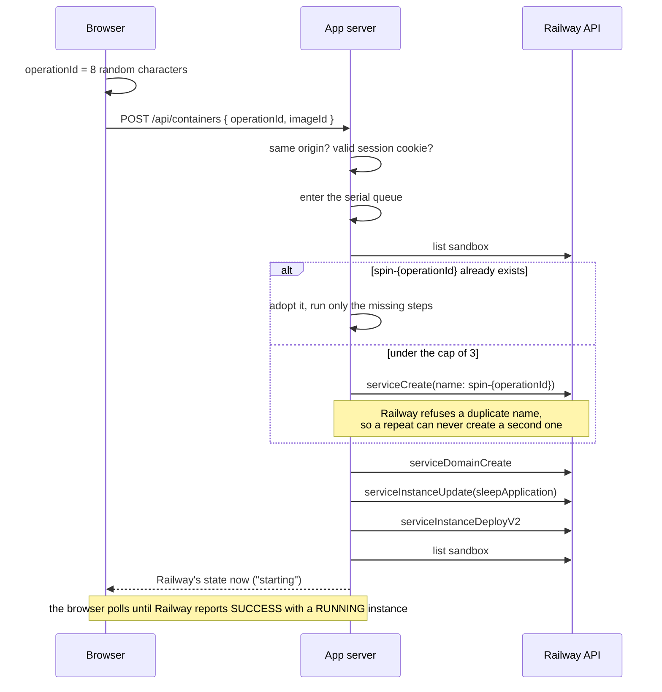
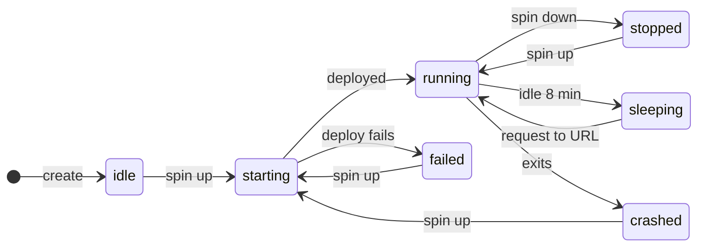
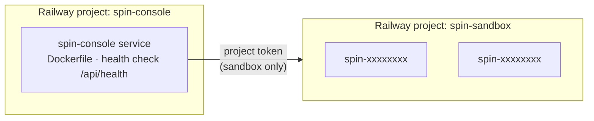

# Spin Console

A small web app that spins containers up and down on [Railway](https://railway.com) through its public GraphQL API. Built for the take-home in Railway's hiring process: *"Build an application to spin up and spin down a container using our GQL API."*

**Live demo:** https://spin-console-production.up.railway.app

Anyone can open it and watch. Making changes needs a passphrase.


## Contents

- [What you can do](#what-you-can-do)
- [How it works](#how-it-works)
- [Container states](#container-states)
- [Design decisions](#design-decisions)
- [Safety limits](#safety-limits)
- [Tech stack](#tech-stack)
- [Project structure](#project-structure)
- [Running it](#running-it)
- [Tests](#tests)
- [Live test](#live-test)
- [Deployment](#deployment)
- [Known limits](#known-limits)
- [Further reading](#further-reading)

## What you can do

| Button | What happens on Railway |
|---|---|
| **Spin up** | A new service is created from the image you picked, given a public URL, and deployed |
| **Spin down** | The container stops. The service and its URL are kept |
| **Spin up** (on a stopped container) | The same container resumes in about a second |
| **Destroy** | The service and its URL are deleted |

Each container card shows its state, its public URL, the exact status Railway reports, its age, and how long until it is removed automatically.

## How it works



The main ideas:

- **Railway is the only source of truth.** The app has no database. Every state on the screen comes from a fresh read of Railway, so a page refresh, an app restart, or a change made in Railway's own dashboard can never leave the app out of step.
- **The browser never talks to Railway.** It talks to the app's own API. The Railway token stays on the server.
- **One module knows about Railway.** Everything in [`src/server/railway`](src/server/railway) sits behind the [`RailwayApi`](src/server/railway/api.ts) interface, so the real client and an in-memory fake are interchangeable.
- **One function decides what a container's state is.** [`deriveState`](src/server/console/derive-state.ts) turns Railway's report into a state and a list of allowed actions. The server sends both to the browser, so a button is disabled for the same reason the API would refuse the request.
- **The app can only reach the sandbox.** It runs in one Railway project and holds a token for a separate sandbox project, so it cannot affect anything else in the account.

### Reading state

The browser asks the app for the current state on a timer. The app decides how often.



- Many open tabs share a single Railway request.
- Reads are paced by a token bucket sized from Railway's `RateLimit-Policy` header, so the app stays inside the hourly API limit however many browsers are polling.
- When no tab is open, the app makes no requests at all.

### Spinning up



- **A double click creates one container.** The browser sends an operation id with each request, the id becomes the service name, and Railway refuses a second service with the same name.
- **Writes run one at a time,** which keeps the three-container limit exact.
- **A lost response is not blindly retried.** If Railway does not answer, the app first checks whether the change happened, and only then decides whether to send it again.

## Container states



Every container also becomes `expired` when it is 30 minutes old, and the app destroys it. Destroy is available in every state except `removing` and `expired`.

| State | What Railway reports | Buttons available |
|---|---|---|
| `idle` | no deployment | Spin up, Destroy |
| `starting` | `INITIALIZING`, `BUILDING`, `DEPLOYING`, `QUEUED` or `WAITING` | Destroy |
| `running` | `SUCCESS`, not stopped, an instance `RUNNING` | Spin down, Destroy |
| `stopping` | `SUCCESS`, stopped, an instance still up | Destroy |
| `stopped` | `SUCCESS`, stopped, instances exited | Spin up, Destroy |
| `sleeping` | `SLEEPING` | Destroy (opening the URL wakes it) |
| `crashed`, `failed` | `CRASHED`, `FAILED` | Spin up, Destroy |
| `removing` | `REMOVING` | none |
| `expired` | older than 30 minutes | none |
| `unknown` | anything else | Destroy |

Railway's fields are easy to misread, so the order of the checks matters:

1. A stopped deployment still has `status: SUCCESS`.
2. A starting deployment has `deploymentStopped: true`.
3. A sleeping deployment has `deploymentStopped: true` and an instance that reads `RUNNING`.

The app therefore reads `status` first, and looks at `deploymentStopped` only when `status` is `SUCCESS`. Anything it does not recognise is shown as `unknown` together with Railway's raw values.

## Design decisions

| Decision | Reason | Alternative not chosen |
|---|---|---|
| No database; Railway holds all state | Nothing to keep in sync after a crash, a refresh, or a change made in Railway's dashboard | A database with an operations table, which adds a second service, migrations and a reconciler |
| The operation id is the service name | Railway rejects duplicate names, which makes "create" safe to repeat | A separate idempotency-key table |
| A serial write queue inside the server | Removes double-click and limit races with very little code | Distributed locks |
| Check Railway before repeating a write | A request with no answer may still have run | Automatic retries |
| Polling, paced by a token bucket | A stop does not change `status`, so a status subscription would miss it. Polling from the browser costs nothing when nobody is looking | GraphQL subscriptions, or a background poller |
| Validate responses with Zod at runtime | The risk is in what actually arrives. A test also checks every GraphQL document against Railway's schema | Generated GraphQL types |
| Show "accepted" separately from the new state | `deploymentStop` returns `true` before the container has stopped, so the screen keeps Railway's reported state until it changes | Optimistic UI |
| A fixed list of tested images | Each image is checked to make sure Railway reports its stop correctly | A free-text image field |

The full reasoning is in [docs/erd.md](docs/erd.md).

## Safety limits

The demo is public, so the app limits what a visitor can do:

- **Passphrase for changes.** Viewing is open. Any change needs a shared passphrase, which is exchanged for a signed, HttpOnly session cookie. Wrong attempts are rate limited.
- **At most 3 containers,** including stopped ones.
- **A fixed list of images.** No free-text image field.
- **30-minute lifetime.** Every container is destroyed automatically.
- **Serverless sleep** is enabled on every container.
- **Only the app's own services are touched.** It lists and acts on services named `spin-` plus 8 characters and ignores everything else in the project.
- **The token stays on the server.** A build check fails if the token or the Railway API host appears in browser code.

The passphrase is a cost barrier, not user authentication.

## Tech stack

| Layer | Choice |
|---|---|
| Framework | Next.js 16 (App Router, route handlers, standalone output) |
| Language | TypeScript (strict) |
| UI | React 19, Tailwind CSS 4 |
| Client data | TanStack Query 5 |
| Validation | Zod 4 |
| Railway API | GraphQL over `fetch` |
| Tests | Vitest, Playwright |
| Runtime | Node 24, Docker |
| Hosting | Railway |

## Project structure

```
src/
  app/
    api/                    route handlers
    page.tsx, layout.tsx    the single page
  components/               console, control panel, container card
  hooks/                    polling and the server clock
  lib/contract.ts           types shared by the server and the browser
  server/
    railway/                everything that talks to Railway
      api.ts                  the interface the rest of the app uses
      transport.ts            HTTP, auth header, error handling, retries
      errors.ts               error classification
      schemas.ts              response validation
      documents.ts            the GraphQL documents
      budget.ts               request counting and read pacing
      fake.ts                 in-memory Railway for tests and local use
    console/
      derive-state.ts         Railway's report -> state and allowed actions
      service.ts              create, start, stop, destroy, lifetimes
      reader.ts               cached reads of the sandbox
      queue.ts                serial write queue
      view.ts                 the data sent to the browser
    auth/                   session cookie and attempt throttle
    runtime.ts              wires the app together
scripts/
  probe.mts                 exercises the real API and records what it does
  smoke.mts                 end-to-end test of the deployed app
  check-bundle.mts          checks that no secret reaches the browser
schema/railway.graphql      Railway's GraphQL schema
tests/fixtures/probe/       recorded API responses used by the tests
e2e/                        Playwright test
docs/                       design document, API findings, code tour
```

## Running it

Requires Node 24.

**Without a Railway account.** The app runs against an in-memory fake that behaves like the real API:

```bash
npm install
npm run dev:fake        # http://localhost:3000, passphrase: demo
```

**Against Railway.** Create an empty Railway project to use as the sandbox, create a project token for its `production` environment (Project → Settings → Tokens), and add three variables to `.env.local`:

```bash
RAILWAY_SANDBOX_TOKEN=   # the project token
CONSOLE_PASSPHRASE=      # any passphrase; it unlocks the buttons
SESSION_SECRET=          # openssl rand -hex 32
```

```bash
npm run dev
```

The app reads the project and environment from the token, so there are no ids to configure. If a value contains `$`, write it as `\$`.

**Scripts**

| Command | What it does |
|---|---|
| `npm run verify` | Lint, type check, unit tests, production build, and the browser bundle check |
| `npm run e2e` | Playwright test against the production build, using the fake |
| `npm run smoke -- <url>` | Tests a deployed app against real Railway |
| `npm run probe -- <scenario>` | Exercises the real Railway API and records the responses |

## Tests

| Test | What it covers |
|---|---|
| [State derivation](src/server/console/derive-state.test.ts) | Every state, the three easy-to-misread cases, and a replay of recorded Railway responses |
| [Railway client](src/server/railway) | Error classification, the retry rule, request pacing, and every GraphQL document checked against Railway's schema |
| [Console service](src/server/console/service.test.ts) | Repeat-safe create, double clicks, lost responses, the container limit under concurrency, automatic expiry, and services the app must never touch |
| [API routes](src/app/api/routes.test.ts) | The passphrase gate, rate limiting, cross-site requests, status codes, and the full lifecycle over HTTP |
| [End to end](e2e/console.spec.ts) | The main flow in a phone-sized browser against the production build |

212 unit and route tests run in under a second with no token and no network access.

## Live test

The deployed app tested against real Railway on 6 October 2026, in a fresh browser at desktop and phone width (`npm run smoke`). Times are in seconds, as a visitor experiences them.

| Step | Desktop | Phone | Result |
|---|---|---|---|
| Open the page | 1.7 | 1.2 | Locked, no containers |
| Unlock with the passphrase | 0.9 | 0.9 | Unlocked |
| Spin up, with a double click | 1.8 | 1.8 | One container created |
| Refresh the page during the deploy | 1.1 | 0.6 | Container still listed |
| Wait for Railway to report running | 6.8 | 9.3 | `SUCCESS`, instance `RUNNING` |
| Open the container's URL | 0.7 | 0.8 | HTTP 200 |
| Spin down | 2.8 | 2.8 | `SUCCESS`, stopped, instance `EXITED` |
| Open the URL while stopped | | | No answer |
| Spin up again | 3.8 | 5.3 | `SUCCESS`, instance `RUNNING` |
| Open the URL again | 0.4 | 0.4 | HTTP 200 |
| Destroy | 4.4 | 4.9 | Container removed |

The sandbox was empty afterwards.

## Deployment



- **Build:** a multi-stage [`Dockerfile`](Dockerfile) that produces Next.js standalone output on Node 24.
- **Health check:** `/api/health` returns 200 when the server is up and correctly configured.
- **Variables:** `RAILWAY_SANDBOX_TOKEN`, `CONSOLE_PASSPHRASE` and `SESSION_SECRET`, set on the service.
- **Deploy:** `railway up --service spin-console`.

## Known limits

- **Single instance.** The write queue, read cache, request counter and attempt throttle live in memory. A second instance could not create duplicates, but could exceed the container limit.
- **The app trusts Railway's report.** If the API reports a wrong status for a container, the app shows it.
- **No history** of who did what.
- **Expiry needs the app running.** If the app is down, containers live past 30 minutes until it is back.
- **`crashed` and `failed` are based on Railway's schema** and have not been seen in a real deployment.

**What I would build next**

1. **Login with Railway (OAuth),** so each visitor uses their own account and the shared passphrase goes away.
2. **A Postgres operations table,** once there are several users or instances, for history and a limit enforced in a transaction.
3. **Logs on each container card.**
4. **A reachability check** that requests each container's URL and flags a mismatch with Railway's reported status.

## Further reading

- [Design document](docs/erd.md): the problem, each decision and its alternative, and the limits.
- [Railway API findings](docs/api-findings.md): how the API behaves in practice, including where it differs from the documentation.
- [Code tour](docs/walkthrough.md): where to start reading and what each part does.

---

Khalid Ahammed · [khalidahammed.com](https://khalidahammed.com) · [github.com/khalid999devs](https://github.com/khalid999devs)
