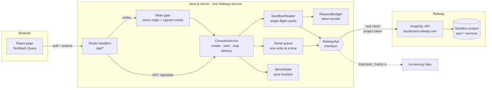
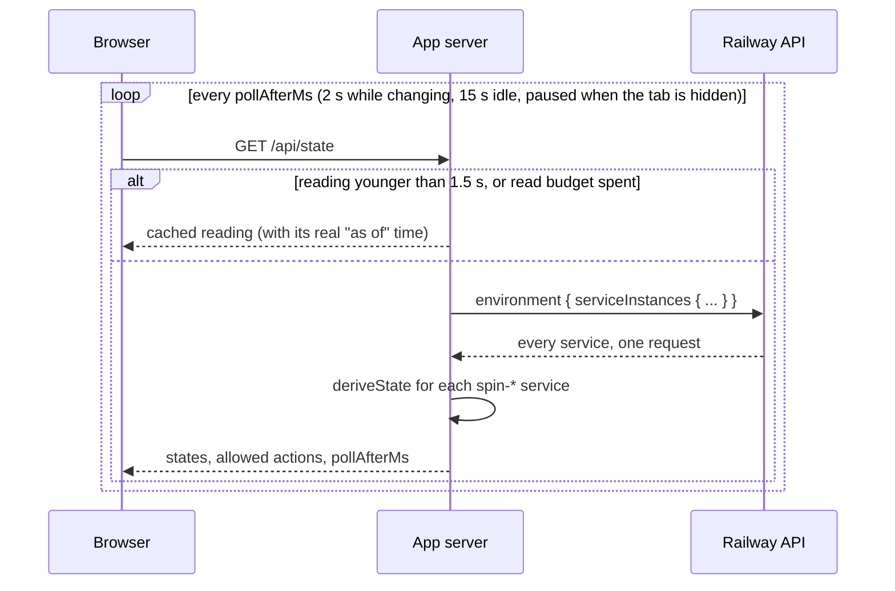
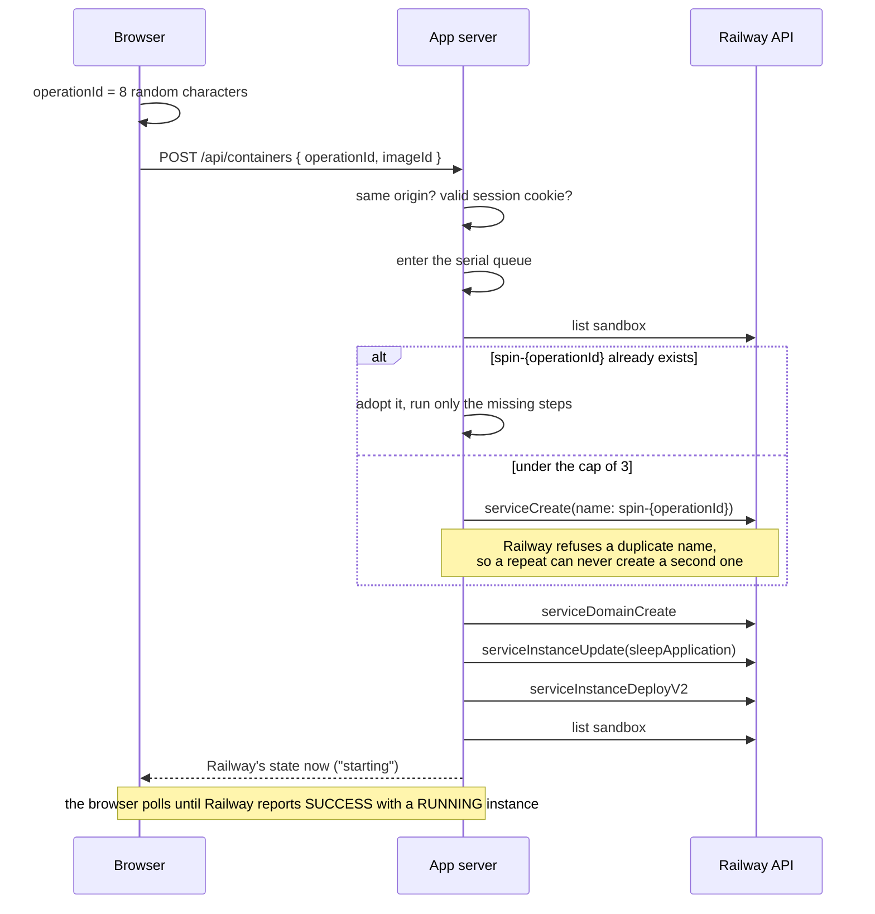
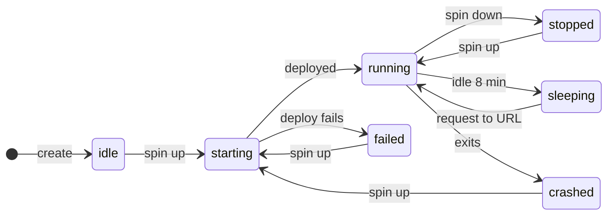
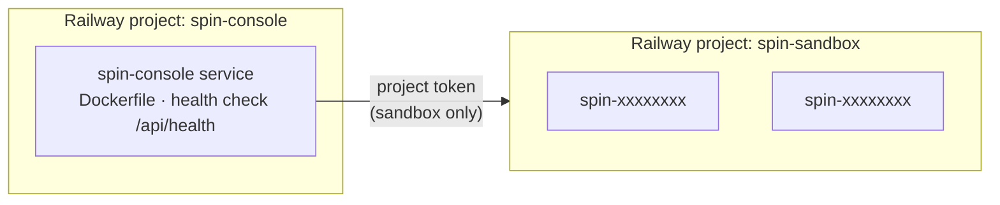

# Spin Console

Spin a container up and down on [Railway](https://railway.com) through its public GraphQL API.

This is my take on the take-home in Railway's hiring process for the Senior Full-Stack Engineer (Product) role: *"Build an application to spin up and spin down a container using our GQL API."* The app keeps no data of its own. Every state on the screen is what Railway reports, read fresh.

**Live:** https://spin-console-production.up.railway.app (anyone can view; changes need a passphrase, which I share for the review)


| | |
|---|---|
| Design reasoning | [docs/erd.md](docs/erd.md) |
| What the API actually did when probed | [docs/api-findings.md](docs/api-findings.md) |
| Code tour | [docs/walkthrough.md](docs/walkthrough.md) |

## Contents

- [What it does](#what-it-does)
- [Architecture](#architecture)
- [Request flows](#request-flows)
- [State model](#state-model)
- [Engineering decisions](#engineering-decisions)
- [Cost and safety guards](#cost-and-safety-guards)
- [Tech stack](#tech-stack)
- [Project structure](#project-structure)
- [Getting started](#getting-started)
- [Testing](#testing)
- [Live smoke test](#live-smoke-test)
- [Deployment](#deployment)
- [Known limits and next steps](#known-limits-and-next-steps)

## What it does

| Action | Railway call | Effect |
|---|---|---|
| **Spin up** (new) | `serviceCreate`, `serviceDomainCreate`, `serviceInstanceUpdate`, `serviceInstanceDeployV2` | A service in the sandbox project from one of three images, with a public URL, deployed |
| **Spin down** | `deploymentStop` | The container stops. The service and its URL stay |
| **Spin up** (again) | `deploymentRestart` | The same container resumes in about a second |
| **Destroy** | `serviceDelete` | The service and its URL are deleted |

Each card shows the state in words, the container's URL, Railway's raw values (`status`, `deploymentStopped`, instance status), its age and the time left before it is destroyed automatically.

## Architecture



Four properties follow from this shape:

- **No database.** The sandbox project is the only store. A refresh, an app restart or a deletion in Railway's dashboard cannot leave the app disagreeing with reality, because there is no second copy to disagree.
- **One boundary.** [`src/server/railway`](src/server/railway) is the only code that knows Railway exists. Everything else depends on the [`RailwayApi`](src/server/railway/api.ts) interface, so the real client and the fake are interchangeable.
- **One decision point.** [`deriveState`](src/server/console/derive-state.ts) turns Railway's report into a state and the allowed actions. The server sends both, so a button is disabled for the same reason the API would refuse the call.
- **Least privilege.** The app runs in one Railway project and holds a project token for a separate sandbox project. A bug in "destroy" cannot reach the app, and a leaked token cannot reach the rest of the account.

## Request flows

### Reading state

The browser polls the app, never Railway (the API's CORS policy allows only `railway.com`, and the token must stay on the server). The server tells the browser how soon to ask again.



Ten open tabs share one Railway request (single flight), and reads spend from a token bucket sized from Railway's `RateLimit-Policy` header. At 1,000 requests an hour that caps reads at 820 an hour whatever browsers do, and leaves the rest for writes. With no tab open, the app makes no requests at all.

### Spinning up



If Railway gives no answer to a mutation, the app does not blindly resend it. It reads the sandbox first to see whether the call took effect ("look before repeating"), and repeats only if it did not.

## State model



Every container also becomes `expired` at 30 minutes old and is destroyed by the app. Destroy is allowed from every state except `removing` and `expired`. Anything the app does not recognise becomes `unknown` and shows Railway's raw values instead of a guess.

How each state is derived, in the order the checks run:

| State | Railway reports | Allowed |
|---|---|---|
| `expired` | older than 30 minutes | nothing (being destroyed) |
| `idle` | no deployment | start, destroy |
| `starting` | `INITIALIZING`, `BUILDING`, `DEPLOYING`, `QUEUED`, `WAITING` | destroy |
| `sleeping` | `SLEEPING` | destroy (wake it by opening its URL) |
| `crashed`, `failed` | `CRASHED`, `FAILED` | start, destroy |
| `removing` | `REMOVING` | nothing |
| `stopped` | `SUCCESS` + `deploymentStopped` + instances exited | start, destroy |
| `stopping` | `SUCCESS` + `deploymentStopped` + an instance still up | destroy |
| `running` | `SUCCESS` + not stopped + an instance `RUNNING` | stop, destroy |
| `unknown` | anything else | destroy |

The order matters, and it comes from probing the API rather than from the docs:

1. A stopped deployment still has `status: SUCCESS`. Reading `SUCCESS` as "up" shows a stopped container as running.
2. A starting deployment has `deploymentStopped: true`. Reading that flag first shows a starting container as stopped.
3. A sleeping deployment has `deploymentStopped: true` **and** an instance reading `RUNNING`.

So `status` is read first, and the flag only when `status` is `SUCCESS`.

## Engineering decisions

| Decision | Why | Rejected |
|---|---|---|
| Railway is the only source of truth | Nothing to reconcile after a crash, a refresh or a change made in Railway's dashboard | A database with an operations table: history and crash recovery, at the price of a second service, migrations and a reconciler |
| Idempotent create from the service name | The browser's operation id becomes the name and Railway rejects duplicates, observed with two simultaneous calls | An idempotency-key table |
| Serial in-process write queue | Removes double-click and cap races on one instance with ten lines of code | Distributed locks |
| "Look before repeating" | A mutation with no answer may have run. Reading Railway first avoids a second domain or a second deploy | Blind retries |
| Polling paced by a token bucket | A stop does not change `status`, so a status subscription would miss it. Browser-driven polling costs nothing when nobody is looking | GraphQL subscriptions, or a background poller |
| Zod at the boundary, documents validated in a test | The risk is in what arrives at runtime. A test validates every GraphQL document against the committed schema | gql.tada or codegen, which type what the schema promises |
| "Accepted" is not "done" | `deploymentStop` returns `true` whether or not anything happens. The UI shows the request was accepted and keeps Railway's reported state until it changes | Optimistic UI |
| An allow-list of probed images | `traefik/whoami` accepts a stop that Railway then never reports. An image is allowed only after `npm run probe -- imageStop <image>` passes | A free-text image field |

The longer argument for each is in [docs/erd.md](docs/erd.md). The probe that drove several of them, including six places where the API differs from its documentation, is written up in [docs/api-findings.md](docs/api-findings.md).

## Cost and safety guards

The URL is public and the credit is mine.

| Guard | Where |
|---|---|
| Reads are open; writes need a passphrase, exchanged for an HMAC-signed, HttpOnly, SameSite=Lax cookie. Wrong attempts are throttled per address | [`src/server/auth`](src/server/auth), [`respond.ts`](src/server/http/respond.ts) |
| At most 3 containers, stopped ones included | [`service.ts`](src/server/console/service.ts) |
| A fixed list of images; no free-text field | [`config.ts`](src/server/config.ts) |
| Every container is destroyed after 30 minutes, by a timer that calls Railway only when one is due | [`service.ts`](src/server/console/service.ts), [`instrumentation.ts`](src/instrumentation.ts) |
| Serverless sleep on every container | [`service.ts`](src/server/console/service.ts) |
| Only services named `spin-` plus 8 characters are ever listed or touched | [`config.ts`](src/server/config.ts), [`view.ts`](src/server/console/view.ts) |
| The token never reaches the browser; a build check proves it | [`scripts/check-bundle.mts`](scripts/check-bundle.mts) |

The passphrase is a cost barrier, not authentication. It has no users and no revocation short of changing it.

## Tech stack

| Layer | Choice |
|---|---|
| Framework | Next.js 16 (App Router, route handlers, standalone output) |
| Language | TypeScript, strict |
| UI | React 19, Tailwind CSS 4 |
| Client data | TanStack Query 5 (server-paced polling) |
| Validation | Zod 4 on every Railway response and request body |
| Railway API | GraphQL over `fetch`, no client library |
| Tests | Vitest 5 (unit and route handlers), Playwright (end to end), graphql-js (document validation) |
| Runtime | Node 24, Docker multi-stage build |
| Hosting | Railway: one project for the app, one sandbox project for the containers |

## Project structure

```
src/
  app/
    api/                    route handlers, a few lines each
    page.tsx, layout.tsx    the single page
  components/               console, control panel, container card
  hooks/                    polling and the server clock
  lib/contract.ts           types shared by server responses and the browser
  server/
    railway/                the Railway boundary
      api.ts                  interface the rest of the app depends on
      transport.ts            auth header, errors-as-HTTP-200, retry rule, timeouts
      errors.ts               classification from message and code
      schemas.ts              Zod shapes for each response
      documents.ts            the nine GraphQL documents
      budget.ts               request count and read token bucket
      fake.ts                 in-memory Railway, computed from a clock
    console/
      derive-state.ts         Railway's report -> state and allowed actions
      service.ts              use cases; idempotent create; look before repeating
      reader.ts               single-flight read cache
      queue.ts                serial write queue
      view.ts                 snapshot sent to the browser
    auth/                   signed session cookie, attempt throttle
    runtime.ts              composition root: picks the real client or the fake
scripts/
  probe.mts                 probes the real API; vets images
  smoke.mts                 live smoke test
  check-bundle.mts          fails if a secret or the API host is in the client bundle
schema/railway.graphql      Railway's schema, introspected without a token
tests/fixtures/probe/       raw request/response logs from the probe, replayed by tests
e2e/                        Playwright
docs/                       ERD, API findings, walkthrough
```

## Getting started

Needs Node 24.

**Without a Railway account.** The app runs against an in-memory fake that behaves the way the probe saw the real API behave:

```bash
npm install
npm run dev:fake        # http://localhost:3000, passphrase: demo
```

**Against Railway.** Create an empty project to act as the sandbox, create a project token for its `production` environment (Project → Settings → Tokens), and put three variables in `.env.local`:

```bash
RAILWAY_SANDBOX_TOKEN=   # the project token
CONSOLE_PASSPHRASE=      # anything; unlocks the buttons
SESSION_SECRET=          # openssl rand -hex 32
```

```bash
npm run dev
```

The app reads the project and environment from the token, so there are no ids to configure.

| Script | What it runs |
|---|---|
| `npm run verify` | lint, typecheck, unit tests, production build, client bundle check |
| `npm run e2e` | Playwright against the production build and the fake |
| `npm run smoke -- <url>` | the live smoke test below (creates real containers) |
| `npm run probe -- <scenario>` | the API probe (`lifecycle`, `followups`, `imageStop <image>`, `cleanup`, …) |

## Testing

| Layer | Covers | Needs |
|---|---|---|
| Unit ([`derive-state.test.ts`](src/server/console/derive-state.test.ts)) | Every state as a table, the three traps, and a replay of the recorded probe run | nothing |
| Unit ([`errors`](src/server/railway/errors.test.ts), [`transport`](src/server/railway/transport.test.ts), [`budget`](src/server/railway/budget.test.ts), [`documents`](src/server/railway/documents.test.ts)) | Classification of the errors the real API returned, the retry rule, the token bucket bound, every document against the schema | nothing |
| Service ([`service.test.ts`](src/server/console/service.test.ts)) | Idempotent create, a double click, lost responses, the cap under concurrency, the lifetime sweep, services it must never touch | the fake |
| Route handlers ([`routes.test.ts`](src/app/api/routes.test.ts)) | The passphrase gate, throttling, cross-site refusal, status codes, the whole lifecycle over HTTP | the fake |
| End to end ([`e2e/console.spec.ts`](e2e/console.spec.ts)) | The main flow at phone width through the production build | the fake, Chromium |
| Live smoke ([`scripts/smoke.mts`](scripts/smoke.mts)) | The deployed app against real Railway | a token |

212 unit and route tests run in under a second, with no token and no network.

To check the tests would notice, I broke seven things on purpose, one at a time, and restored them:

| Deliberate break | Result |
|---|---|
| `deriveState` reads `deploymentStopped` before `status` | 29 tests fail |
| A mutation is repeated without looking at Railway first | 4 tests fail |
| Every service in the sandbox counts as the app's own | 5 tests fail |
| The session signature is not checked | 3 tests fail |
| The transport retries mutations like queries | 1 test fails |
| Writes skip the serial queue | 2 tests fail |
| The API host is imported into a client component | `check:bundle` fails |

## Live smoke test

Run on 6 Oct 2026 at 09:41 UTC with `npm run smoke -- https://spin-console-production.up.railway.app`: the deployed app, real Railway, and a new browser context for each pass (no cookies, no cache). "Seconds" is what a visitor waits, so it includes the app's 2-second polling.

**Desktop, 1280 px**

| Step | Seconds | Result |
|---|---|---|
| Open the page | 1.7 | locked, 0 containers |
| Unlock with the passphrase | 0.9 | unlocked |
| Spin up (double click) until the card appears | 1.8 | 1 container, spin-09b6644c |
| Refresh the page mid-deploy | 1.1 | 1 container still listed |
| Wait until Railway reports running | 6.8 | SUCCESS · stopped no · RUNNING |
| Request the container's own URL | 0.7 | HTTP 200 |
| Spin down until Railway reports stopped | 2.8 | SUCCESS · stopped yes · EXITED |
| Request the URL while stopped | 8.0 | no answer within 8 s |
| Spin up again until Railway reports running | 3.8 | SUCCESS · stopped no · RUNNING |
| Request the URL again | 0.4 | HTTP 200 |
| Destroy (two taps) until the card is gone | 4.4 | 0 containers |

**Phone, 412 px (Pixel 7)**

| Step | Seconds | Result |
|---|---|---|
| Open the page | 1.2 | locked, 0 containers |
| Unlock with the passphrase | 0.9 | unlocked |
| Spin up (double click) until the card appears | 1.8 | 1 container, spin-32986bb9 |
| Refresh the page mid-deploy | 0.6 | 1 container still listed |
| Wait until Railway reports running | 9.3 | SUCCESS · stopped no · RUNNING |
| Request the container's own URL | 0.8 | HTTP 200 |
| Spin down until Railway reports stopped | 2.8 | SUCCESS · stopped yes · EXITED |
| Request the URL while stopped | 8.0 | no answer within 8 s |
| Spin up again until Railway reports running | 5.3 | SUCCESS · stopped no · RUNNING |
| Request the URL again | 0.4 | HTTP 200 |
| Destroy (two taps) until the card is gone | 4.9 | 0 containers |

Afterwards the sandbox held 0 containers, and the app had made 59 of its 1,000 hourly Railway requests.

Two things from an earlier run the same day, read from the app's HTTP log:

- **The double click really did send two requests.** Two `POST /api/containers` arrived in the same second with one operation id, and one container was created.
- **One destroy took 17.9 s.** Railway had not answered `serviceDelete` within the app's 15-second timeout. The app looked at Railway, saw the container was gone and reported success. The write timeout is now 30 seconds so a slow delete is not sent twice.

## Deployment



- **Build:** a multi-stage [`Dockerfile`](Dockerfile) producing Next.js standalone output on Node 24. The server is started with `node server.js` directly, so `SIGTERM` reaches it and a clean stop is not reported as a crash.
- **Health check:** `/api/health` answers 200 when the process is up and its configuration is complete. It does not call Railway's API, so an API outage cannot take the app's own deploy down.
- **Variables:** `RAILWAY_SANDBOX_TOKEN`, `CONSOLE_PASSPHRASE`, `SESSION_SECRET`, set in the service's Variables tab.
- **Deploy:** `railway up --service spin-console`.

## Known limits and next steps

**Limits**

- **One app instance.** The write queue, read cache, request budget and attempt throttle are in memory. Two instances could not create duplicates, because Railway's name uniqueness is the lock, but could race past the cap.
- **As right as Railway's report.** The app repeats what the API says, and the `traefik/whoami` case shows the API can be wrong about a container.
- **No history** of who did what.
- **The lifetime needs the app running.** While it is down, containers outlive 30 minutes; serverless sleep bounds the cost.
- **`crashed` and `failed` have not been seen against the real API.** No probe deploy failed, so those two states come from the schema's enum.
- **In fake mode a sleeping container stays asleep,** because its URL is not real and cannot be opened to wake it.

**Next, in order**

1. **Login with Railway (OAuth).** Each visitor uses their own account; the shared token and the passphrase disappear.
2. **A Postgres operations table and a reconciler,** once there are several users or instances: history, crash recovery, a cap enforced in a transaction.
3. **Logs on each card** from `deploymentLogs`.
4. **A report-versus-reality check:** request each running container's URL and flag when Railway says running and nothing answers.

## Notes

I built this with Claude Code, working from a brief I prepared: it wrote the code, the probe and the first drafts of these documents. The constraints were mine (small and stateless instead of a database and a background observer, the two-project split, the cost guards, a phone-first screen), and I reviewed the design before the build and accepted the changes the probe forced.

The brief included API behaviour reported in the write-ups of two public solutions to this take-home, [paveliko/railway-container-console](https://github.com/paveliko/railway-container-console) and [V473r10/railway-take-home](https://github.com/V473r10/railway-take-home). I did not read their source code. Every finding marked "Observed" in [docs/api-findings.md](docs/api-findings.md) comes from my own probe, and its raw logs are in [`tests/fixtures/probe`](tests/fixtures/probe). Both of those solutions are larger, with a database and a background observer; this one stores nothing and polls only while someone is looking.

---

Khalid Ahammed · [khalidahammed.com](https://khalidahammed.com) · [github.com/khalid999devs](https://github.com/khalid999devs)
